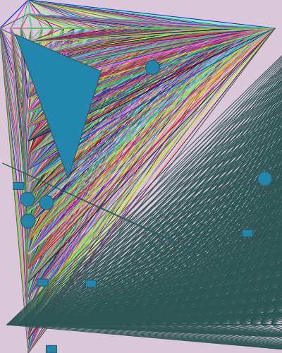

- I have always been interested in things that move, and using the nested for loop in this assignment gave me the opportunity to play around. 
- I came across the random function and started playing around with it and made random moving shapes which changed colors also.
- I realised that adding comments to my code helped me structure and understand it better so I have started doing that.
- **  ** I have uploaded the small video version as well - it has to be downloaded to be viewed so feel free to do that.

