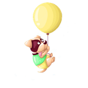

## CONCEPT

Since I was a kid, I have always been fascinated by dogs. They are my favorite animal and for this very reason, my game will be about dogs. In this game, there will be a dog which is potentially seen to "fly" throughout the game, while dodging the obstacles that comes its way. To make it whimsy, I tried to make the obstacles realistic, something that dogs are wary of. In this case, I have chosen chocolate as chocolate is seen to be fatal for dogs if it is consumed. Since the dog is holding a balloon for it's way of flying, it makes sense for me to add needles as they can serve as a potential threat (as it can pop the balloon, resulting in the dog falling down.) I will continue to brainstorm more ideas when it comes to thinking about certain obstacles. My dog will move LEFT and RIGHT under specific conditions to avoid the obstacles. 

## IMAGE OF DOG

The image describes a dog holding a balloon. I had to remove the background to use it in the game, and in order to do that, I used (https://www.remove.bg) to remove the background. It was difficult to remove all of it using this website, so some parts I had to do manually. 

This is the image of the dog with the background:


I had to manually remove the background to make it fit and suit my game better. Here is the image of the dog without the background:



To add on, I wanted to use a background which would be moving, so I will start of by using clouds. Here is the image of the cloud:


## DIFFICULTY

In order for my game to work, I need to make it look like the background is moving, so in order to do that the background needs to be moving down. This is something that I found a bit complicated as it was difficult to make the clouds move downwards and be in propotion with the canvas. 

## SOLUTION OF DIFFICULTY

Finally, I figured out a way to move the clouds. I did this by creating a class for the clouds, in which then I update() method in this class which makes the clouds go down by increasing the Y value. The display() method displays the clouds in my game then. I then added objects of clouds to an array. When the clouds reach the bottom of the screen, more clouds are added to the array and the old ones are erased. Below is some of the code which I used to fix this issue I encountered:


## This function is seen to update the y-axis of the clouds which then makes it appear as the clouds are going down. This is done by increasing the Y value. 

```
update() {
    //this function updates the y-axis of the clouds so it appears as if they are going down (by increasing the y value)
    this.y += 1;
    if (this.y >= widthDimension) {
      //if the clouds have reached the bottom, add 2 more random clouds and erase the old ones from the array
      addClouds();
    }
   ```
   ### This resets the array so the clouds are removed. 
   
   ```
function addClouds() {
  clouds = []; //resets the array so that the old clouds are removed
  for (let x = 0; x < numClouds; x++) {
    //adds number of clouds to the array
    xCoord = random(20, widthDimension - 20); //randomly pick x-coordinate so it isnt repetitive
    append(clouds, new Cloud(xCoord)); //add the new cloud to the array
  }
  ```
### This is a loop, and it makes it look like the clouds are reappearing. 

  ```
  //the following for loop displays the clouds
  for (let i = 0; i < clouds.length; i++) {
    clouds[i].update(); //makes clouds go down, refer to the class method for more information
    clouds[i].display(); //displays the clouds
  }
```
